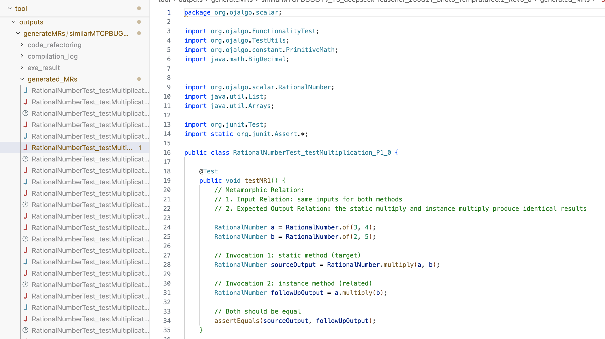

# MR-Coupler Prototype

**MR-Coupler** is an automated approach to automatically generate metamorphic test case via functional coupling analysis.


## Environment Configuration 

* Java: 11.0.18
* Python: 3.10, the required depdencies can be found in `requirements.txt`

#### Subjects preparation
* Download the projects from [dataset1](https://github.com/MR-Coupler/MR-Coupler.github.io/blob/main/data/Human-written-MTCs.json) or [dataset2](https://github.com/MR-Coupler/MR-Coupler.github.io/blob/main/data/Bug-Revealing-MTCs.json) into the `inputs/experiemental_projects` directory.


#### Setting API key for LLMs
* Edit file `MR-Coupler/request_LLMs.py` and update the following fields.

``` python 
# To config
client = 
```

## Demo: Metamorphic test case (MTCs) generation 

#### prepare the experimental project
* download `example_inputs.tar.gz` and `example_outputs.tar.gz` from https://doi.org/10.5281/zenodo.19438045
* decompress the `example_inputs.tar.gz` to replace the  `tool/inputs/` folder
* decompress the `example_outputs.tar.gz` to replace the  `tool/outputs/` folder

#### execute the tool   
* Navigate to `tool/bugrevealingmrgen` directory and execute the following command:

```cmd
$ cd tool/bugrevealingmrgen; python generate_MTCs.py 
```

#### Output:
* generated MTCs can be found at `tool/outputs/generateMRs/xxx/generated_MRs/`
* Example:




#### Update

If you have any questions or issues, please feel free to report an issue. We will continue to maintain this project. Thanks for your feedback😄. 